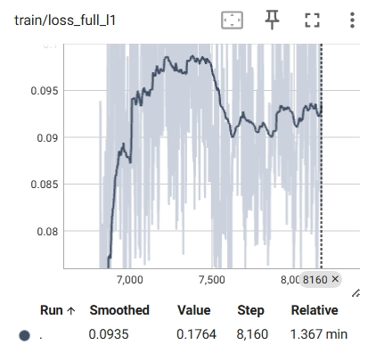
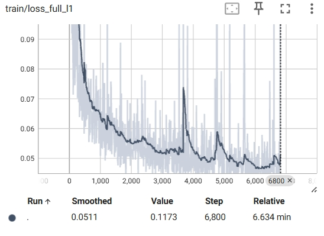

# 实验排查记录

## 2026-05-17 17:37:01 CST - VIAI-AV loss 方向异常排查

### 背景

训练命令：

```bash
python main.py train-viai-av -- \
  --data_root "$DATA_ROOT" \
  --train_split_name train_av_split.txt \
  --val_split_name val_av_split.txt \
  --init_from_viai_a checkpoints/VIAI-A-PatchGAN_checkpoint_step000006800.pth.tar \
  --batch_size 16 \
  --num_workers 4 \
  --beta_gan 0.1 \
  --checkpoint_interval 1000 \
  --print_freq 100 \
  --display_id 0
```

现象：TensorBoard 中 `train/loss_full_l1`、`train/loss_missing_l1` 上升，`train/psnr_full`、`train/psnr_missing` 下降；验证集同样变差，表现为“越训越差”。

### 已确认事实

1. 本次导出的 `output.txt` 中没有 `train/loss_sync`、`train/loss_probe_gen`、`train/eta2` 等标量。
2. 因此这次 7126-step 结果不是当前 Stage4 sync/probe 默认开启后的日志，而是旧 Stage3 风格的 VIAI-AV run，或 TensorBoard 指向了旧 event 文件。
3. 论文公式摘录中 VIAI-AV generator loss 为：

```text
L_av_gen = L_av_GAN + beta * L_av_re
L_av_re = eta1(t) * full_l1 + missing_l1
```

4. 当前代码 `Models/VIAI_AV_inpainting.py` 中的实现与论文公式一致：

```python
loss_recon = eta1 * loss_full_l1 + loss_missing_l1
loss_av_gen = loss_G_GAN + beta_gan * loss_recon
```

注意：这里的 `beta_gan` 参数名很容易误导。它在当前代码里实际对应论文中的 `beta`，也就是 reconstruction loss 的权重，不是 GAN loss 的权重。

### 关键标量证据

7126-step run 的末尾标量：

```text
train/loss_total       last = 0.767486
train/loss_g_gan       last = 0.745425
train/loss_recon       last = 0.220610
train/loss_full_l1     last = 0.119271
train/loss_missing_l1  last = 0.164309
train/eta1             last = 0.472039
train/psnr_full        last = 16.311
train/psnr_missing     last = 13.952

val/loss_total         last = 0.947441
val/loss_g_gan         last = 0.918362
val/loss_recon         last = 0.290781
val/loss_full_l1       last = 0.115067
val/loss_missing_l1    last = 0.175714
val/eta1               last = 1.000000
val/psnr_full          last = 16.765
val/psnr_missing       last = 13.485
```

在训练命令 `--beta_gan 0.1` 下：

```text
beta_gan * train/loss_recon ~= 0.1 * 0.220610 = 0.022061
train/loss_g_gan ~= 0.745425
```

因此总损失几乎由 GAN loss 主导，重建 L1 对优化方向的约束很弱。这可以解释 L1/PSNR 随训练变差。

### 初步结论

当前 loss 公式没有相对论文写反；更可能的问题是训练配置中 `--beta_gan 0.1` 让 reconstruction loss 权重过小。若使用者把 `beta_gan` 理解成“GAN loss 权重”，就会和当前代码语义相反。

另外，`Models/VIAI_AV_inpainting.py` 的 `test()` 中调用 `_compute_losses(global_step=0)`，导致验证阶段 `val/eta1` 永远为 1.0。这个问题不会直接影响 PSNR，但会让 `val/loss_recon`、`val/loss_total` 的权重语义与训练当前 step 不一致。

### 建议验证实验

优先做短跑对照，确认是否是重建项权重过小导致反向优化。

实验 A：提高 reconstruction 权重到 1.0。

```bash
python main.py train-viai-av -- \
  --data_root "$DATA_ROOT" \
  --train_split_name train_av_split.txt \
  --val_split_name val_av_split.txt \
  --init_from_viai_a checkpoints/VIAI-A-PatchGAN_checkpoint_step000006800.pth.tar \
  --batch_size 16 \
  --num_workers 4 \
  --beta_gan 1.0 \
  --checkpoint_interval 1000 \
  --print_freq 100 \
  --display_id 0 \
  --log_event_path checkpoints/events_viai_av_beta1
```

实验 B：进一步提高 reconstruction 权重到 10.0。

```bash
python main.py train-viai-av -- \
  --data_root "$DATA_ROOT" \
  --train_split_name train_av_split.txt \
  --val_split_name val_av_split.txt \
  --init_from_viai_a checkpoints/VIAI-A-PatchGAN_checkpoint_step000006800.pth.tar \
  --batch_size 16 \
  --num_workers 4 \
  --beta_gan 10.0 \
  --checkpoint_interval 1000 \
  --print_freq 100 \
  --display_id 0 \
  --log_event_path checkpoints/events_viai_av_beta10
```

判断标准：

1. 若 `train/loss_full_l1`、`train/loss_missing_l1` 不再持续上升，且 `train/psnr_full`、`train/psnr_missing` 不再持续下降，则基本坐实主因是 reconstruction 权重过小。
2. 若 `val/psnr_missing` 也随之改善，说明问题不是单纯过拟合，而是目标函数权重方向导致训练目标与评估指标不一致。
3. 若提高 `beta_gan` 后仍恶化，再继续排查视频融合初始化、判别器过强、学习率、数据对齐和 mask 合成逻辑。

### 后续代码修正建议

为避免再次混淆，建议后续将参数语义改清楚：

```text
--lambda_recon  # reconstruction loss 权重，对应论文 beta
--lambda_gan    # GAN loss 权重，默认 1.0
```

并在 TensorBoard 中额外写入：

```text
train/weighted_loss_recon = beta_gan * loss_recon
train/weighted_loss_gan = loss_g_gan
```

这样之后可以直接看到各 loss 项对总损失的实际贡献。


### 2026-5-20 17:46:    VIAI-A+PatchGan loss 方向异常排查

#### 背景

本次对比的是两组训练曲线：



1. `VIAI-A` audio-only baseline，训练 100 epoch，末尾约 6800 step。
2. `VIAI-A + PatchGAN`，从 `VIAI-A` 第 100 epoch checkpoint 接续训练到 120 epoch，约等于额外训练 20 epoch。

现象：

1. 加入 PatchGAN 后，`train/loss_full_l1` 和 `train/loss_missing_l1` 不再下降，反而明显变差。
2. `train/psnr_full`、`train/ssim_full` 相比纯 `VIAI-A` 明显降低。
3. `train/loss_g_gan` 上升，`train/loss_d` 下降，说明判别器逐渐变强，生成器越来越难骗过判别器。
4. PatchGAN 阶段的 `train/loss_recon`/`train/loss_total` 曲线看起来像从 0 附近骤升。

#### 已确认实现

`VIAI-A + PatchGAN` 没有单独的新生成器。生成器仍然是：

```text
MelEncoder + MelDecoder
```

PatchGAN 部分只新增 Mel 判别器 `MelDiscriminator` 和对应 GAN loss。生成器训练目标为论文第 3 页公式：

```text
L_total = L_GAN + beta * L_re
L_re = eta1(t) * full_l1 + missing_l1
```

当前代码已将 `Models/VIAI_A_inpainting.py` 中的 PatchGAN generator loss 显式整理为：

```python
self.weighted_loss_recon = beta_recon * self.loss_recon
self.weighted_loss_gan = self.loss_G_GAN
self.loss_total = self.weighted_loss_gan + self.weighted_loss_recon
```

并在 `base_options.py` 中新增 `--beta_recon`，同时保留 `--lambda_recon` 作为兼容旧命令的 reconstruction 权重别名。

#### 对曲线的解释

从 `VIAI-A` checkpoint 接续训练本身不是错误，但它会造成一个很明显的训练目标切换：

```text
前 100 epoch:
只优化 L_recon

接续 PatchGAN:
优化 L_GAN + beta * L_recon
```

此时判别器 `netD` 是新加入的，或者至少处于与已有生成器不平衡的状态。生成器原本已经收敛到较好的 L1 重建位置，突然加入 GAN 梯度后，优化方向会被对抗项拉走，因此 `loss_full_l1`、`loss_missing_l1` 变差是合理现象。

`loss` 从 0 附近骤升不一定表示 checkpoint 加载坏了，主要有两个原因：

1. `loss_recon`/`loss_g_gan` 这类 tag 在纯 `VIAI-A` 阶段可能没有写入，开启 PatchGAN 后才开始出现，TensorBoard 会显示为突然出现。
2. PatchGAN 后的 `loss_total` 多了 `loss_g_gan`，而 GAN loss 初始常在 `0.6~0.9` 左右，数值尺度明显大于 L1 reconstruction loss。

#### 初步结论

当前曲线说明：在本次设置下，PatchGAN 对 Mel 频谱图的逐点重建指标是负收益。

更具体地说，它不一定证明 PatchGAN 理论上无效，但说明当前权重/训练节奏下，判别器约束过强，生成器为了骗过判别器牺牲了 `full_l1`、`missing_l1`、PSNR 和 SSIM。

#### 排查与验证方案

优先验证 reconstruction 权重是否过小。建议从同一个 `VIAI-A` 100 epoch checkpoint 开始，做短跑对照实验。

实验 A：提高 reconstruction 权重到 10。

```bash
python main.py train-viai-a -- \
  --use_gan \
  --name VIAI-A-PatchGAN-beta10 \
  --data_root "$DATA_ROOT" \
  --train_split_name train_viai_a_split.txt \
  --val_split_name val_viai_a_split.txt \
  --resume \
  --resume_path checkpoints/VIAI-A_checkpoint_step000006800.pth.tar \
  --reset_optimizer \
  --batch_size 16 \
  --num_workers 4 \
  --beta_recon 10.0 \
  --checkpoint_interval 1000 \
  --print_freq 100 \
  --display_id 0 \
  --log_event_path checkpoints/events_viai_a_patchgan_beta10
```

实验 B：进一步提高 reconstruction 权重到 50。

```bash
python main.py train-viai-a -- \
  --use_gan \
  --name VIAI-A-PatchGAN-beta50 \
  --data_root "$DATA_ROOT" \
  --train_split_name train_viai_a_split.txt \
  --val_split_name val_viai_a_split.txt \
  --resume \
  --resume_path checkpoints/VIAI-A_checkpoint_step000006800.pth.tar \
  --reset_optimizer \
  --batch_size 16 \
  --num_workers 4 \
  --beta_recon 50.0 \
  --checkpoint_interval 1000 \
  --print_freq 100 \
  --display_id 0 \
  --log_event_path checkpoints/events_viai_a_patchgan_beta50
```

实验 C：如果 beta=50 仍不能稳定 L1，再尝试 beta=100。

```bash
python main.py train-viai-a -- \
  --use_gan \
  --name VIAI-A-PatchGAN-beta100 \
  --data_root "$DATA_ROOT" \
  --train_split_name train_viai_a_split.txt \
  --val_split_name val_viai_a_split.txt \
  --resume \
  --resume_path checkpoints/VIAI-A_checkpoint_step000006800.pth.tar \
  --reset_optimizer \
  --batch_size 16 \
  --num_workers 4 \
  --beta_recon 100.0 \
  --checkpoint_interval 1000 \
  --print_freq 100 \
  --display_id 0 \
  --log_event_path checkpoints/events_viai_a_patchgan_beta100
```

#### 判断标准

1. 若提高 `--beta_recon` 后，`train/loss_full_l1`、`train/loss_missing_l1` 不再持续上升，说明主因是 GAN 项相对 reconstruction 项过强。
2. 若 `val/loss_missing_l1`、`val/psnr_missing` 同步改善，说明问题不是单纯训练集波动，而是 loss 权重导致的优化方向偏移。
3. 若 `loss_d` 继续快速下降且 `loss_g_gan` 继续上升，同时 L1 仍变差，说明判别器仍然过强，需要考虑降低判别器学习率、降低判别器更新频率，或冻结生成器/判别器做更平滑的 warm-up。
4. 最终以 `test/mel_l1_missing`、`test/psnr_missing`、Mel 对比图和 vocoder 导出的音频为准。`psnr_full`/`ssim_full` 可作为参考，但实际修复更关注缺失区域。

#### 后续可选改动

若单纯增大 `--beta_recon` 仍不稳定，可以继续做以下改动：

1. 为判别器单独增加学习率参数，例如 `--lr_d`，令 `lr_d < lr_g`。
2. 增加判别器更新间隔，例如每 2 到 5 个 generator step 更新一次 `netD`。
3. PatchGAN 前若从纯 `VIAI-A` checkpoint 热启动，可以先用较大的 `--beta_recon` 训练若干 step，再逐步降低 beta，让 GAN 影响缓慢进入。
4. TensorBoard 重点观察 `weighted_loss_recon`、`weighted_loss_gan`、`loss_d`、`loss_g_gan`、`loss_missing_l1` 和 `psnr_missing`，避免只看 `loss_total`。
